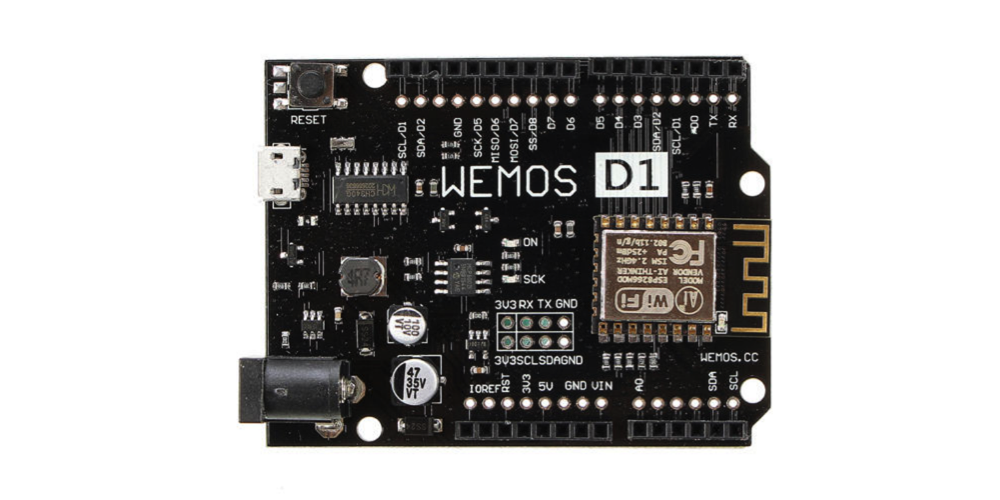
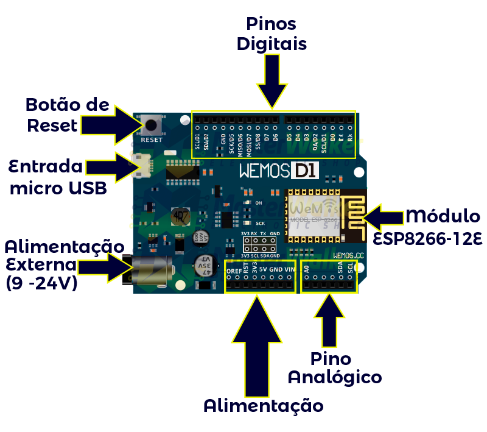
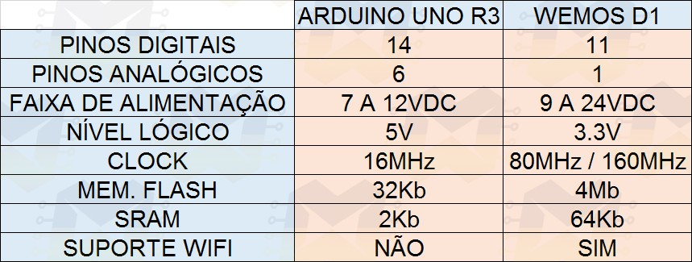

# Wemos D1 R2

É uma plataforma de prototipagem que possui as mesmas dimensões do Arduino Uno R3. As diferenças mais básicas em relação ao Arduino são o conector micro USB e um ESP8266-12E. A Wemos D1 já conta com WiFi nativo, o que a torna uma plataforma extremamente atraente para desenvolvimento de projetos Iot.

## Sumário
* [Informações Gerais](#user-content-informacoes_gerais)
* [Figuras](#Figuras)
* [Tecnologia](#tecnologia)
* [Setup](#setup)
* [Features](#features)
* [Exemplos](#Exemplos)
* [Status](#status)
* [Inspiração](#inspiração)
* [Contato](#contato)

<h2 id="informacoes_gerais">Informações Gerais</h2>
A Wemos D1 já conta com WiFi nativo, o que a torna uma plataforma extremamente atraente para desenvolvimento de projetos Iot. Atualmente a placa se encontra na versão R2.

Principais características da placa:

&ndash; Processador ESP8266-12E   &ndash; Arquitetura RISC de 32 bits   &ndash; Processador pode operar em 80MHz / 160MHz   &ndash; 4Mb de mem&oacute;ria flash   &ndash; 64Kb para instru&ccedil;&otilde;es   &ndash; 96Kb para dados   &ndash; WiFi nativo padr&atilde;o 802.11b/g/n   &ndash; Opera em modo AP, Station ou AP + Station   &ndash; Pode ser alimentada com 5VDC atrav&eacute;s do conector micro USB   &ndash; Atrav&eacute;s do pino jack pode ser alimentada com tens&atilde;o na faixa de 9 a 24VDC   &ndash; Possui 11 pinos digitais   &ndash; Possui 1 pino anal&oacute;gico com resolu&ccedil;&atilde;o de 10 bits   &ndash; Pinos digitais, exceto o D0 possuem interrup&ccedil;&atilde;o, PWM, I2C e one wire   &ndash; Pinos operam em n&iacute;vel l&oacute;gico de 3.3V   &ndash; Pinos n&atilde;o tolerantes a 5V   &ndash; Conversor USB Serial CH340G   &ndash; Program&aacute;vel via USB ou WiFi (OTA)   &ndash; Compat&iacute;vel com a IDE do Arduino   &ndash; Compat&iacute;vel com m&oacute;dulos e sensores utilizados no Arduino   &ndash; Compat&iacute;vel com alguns shields da linha Arduino

Um ponto importante a ser observado é que alguns shields podem exigir uma tensão e corrente superior a máxima fornecida pela Wemos, portanto, fique atento as especificações dos shields que for utilizar com ela.

Outro diferencial da Wemos D1 é a possibilidade de fazer a programação da placa via OTA (Over The Air), ou seja, através do WiFi você pode enviar os códigos para a placa.

Fonte: http://blogmasterwalkershop.com.br/embarcados/wemos/conhecendo-a-wemos-d1/

## Figuras

## Tecnologia
* Tech 1 
* Tech 2 
* Tech 3 

## Setup
Describe how to install / setup your local environement / add link to demo version.

## Exemplos
Show examples of usage:
`put-your-code-here`

## Features
Lista de funcionalidades de futuros desenvolvimentos
* feature 1
* feature 2
* feature 3

Novos desenvolvimentos:
* Wow improvement to be done 1
* Wow improvement to be done 2

## Status
Project is: _in progress_, _finished_, _no longer continue_ and why?

## Inspiração
Add here credits. Project inspired by..., based on...

## Contato
Criado/adaptado por Epaminondas Lage - epaminondaslage@gmail.com ou epaminondaslage@cefetmg.br
